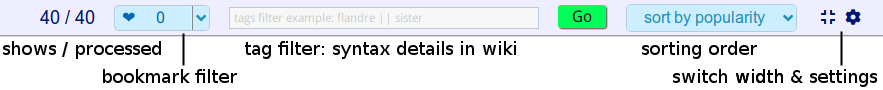
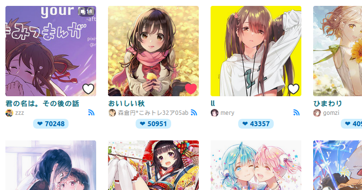
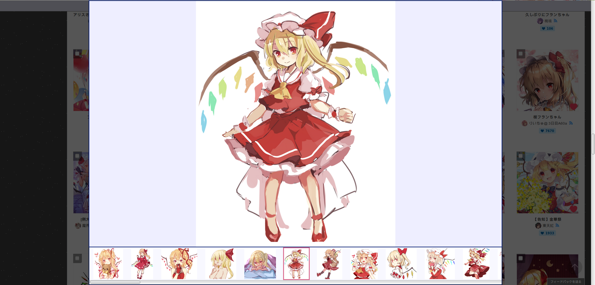

[English](https://github.com/FlandreDaisuki/Patchouli/blob/master/README.en.md) - [中文](https://github.com/FlandreDaisuki/Patchouli/blob/master/README.md)

- [Introduction](#introduction)
- [Installation](#installation)
  - [Compatibility Table](#compatibility-table)
- [Functions](#functions)
  - [Demo Video](#demo-video)
  - [Control Panel](#control-panel)
  - [Image items](#image-items)
  - [Preview Mode](#preview-mode)
- [Contribution](#contribution)
- [Lisence](#lisence)
- [Changelog](#changelog)

## Introduction

A simple pixiv crawler. Naming is inspired from **Touhou Project**.

## Installation

1. First, install [Tampermonkey](https://chrome.google.com/webstore/detail/tampermonkey/dhdgffkkebhmkfjojejmpbldmpobfkfo) for Chrome or [Tampermonkey](https://addons.mozilla.org/zh-TW/firefox/addon/tampermonkey/) for Firefox or [other userscript managers](https://greasyfork.org/help/installing-user-scripts) you like.
2. Then, click [**`here`**](https://rawgit.com/FlandreDaisuki/Patchouli/master/dist/patchouli.user.js)

### Compatibility Table

|×||||
|:--:|:--:|:--:|:--:|
||✔️|✔️|🔺|
||✔️|✔️| N/A |

🔺 Not support Greasemonkey ugoira autoplay ([#22](https://github.com/FlandreDaisuki/Patchouli/issues/22))

## Functions

### Demo Video

### Control Panel

- Press `GO`, find all. (No need pagination any more)
- The UI with i18n (en, ja, zh-cn, zh-tw) **Welcome translation PR**
- Filter by **bookmarks count**
- Filter by **Tag Filter Query** 
   - Basic examples: `flandre`, `users入り`, `-R-18`
   - Logical operator examples: `flandre || koishi`, `touhou && R-18`
   - complicated examples: `touhou && {flandre || alice}`
   - More details in [wiki](https://github.com/FlandreDaisuki/Patchouli/wiki/Tag-Filter-Query-Usage)
- Sort by **bookmarks count**or **upload time** or **bookmark added time**
- Use icon   to switch width
- Settings:
   - Switch right click extension
   - Switch illustrator tooltip (the popup when mouse over illustrator name)
   - Switch ugoira autoplay
   - Blacklist

### Image items
- Use icon  to indicate following illustrator
- Use icon   to indicate bookmarked (public/private) or not, click icon can add or remove bookmark directly

Autoplay ugoira when mouse over ⚠️ This feature uses network bandwith quite heavily ⚠️

Right click extension
- Click on image
   - Like
   - Download original size image (only support single image)
   - Preview images in preview mode
   - Open add bookmark (with tags) page
- Click on illustrator name
   - Follow
   - Blacklist (simulate mute function)

### Preview Mode

Support single, multiple, and ugoira illustration, and manipulate with mouse click and wheel scroll.

## Contribution

- Please tell me if you found bugs: [Bug report](https://github.com/FlandreDaisuki/Patchouli/issues/new?template=Bug_report.md) 🐛🐛
- Also, welcome feature request: [Feature request](https://github.com/FlandreDaisuki/Patchouli/issues/new?template=Feature_request.md) 💡💡
- And also welcome source contribution: [pull request](https://github.com/FlandreDaisuki/Patchouli/pulls) ⌨️⌨️
- Share and give me a ⭐️ to encourage me to maintain this project, and thanks [contributors](https://github.com/FlandreDaisuki/Patchouli/graphs/contributors) 👍👍

## Lisence

The MIT License (MIT)

Copyright (c) 2016-2018 FlandreDaisuki

## Changelog

2018-99-99 v4.2.0

- Refactoring code
- Support [new profile page](https://www.pixiv.net/info.php?id=4704)
- Support mouse wheel in showing original images
- Change tag filter from **RegExp** to **Tag Filter Query**
- Adjust styles

2018-08-03 v4.1.10

- The heart icon that can one click bookmark supports one click unbookmark (#23, #25)

2018-07-04 v4.1.9

- Support Greasemonkey download with right click extension

2018-06-28 v4.1.8

- Support arrow keys (← and →) in showing original images

2018-06-25 v4.1.7

- Reduce packets in showing multiple original images

2018-06-25 v4.1.6

- Fix multiple not show original images (#21)

2018-06-18 v4.1.5

- Autoplay ugoira when mouse over (configurable)
   - **!CAUTION!** This feature uses network bandwith quite heavily.

2018-06-18 v4.1.4

- Right click extension previewing supports ugoira (small size and original size)

2018-06-16 v4.1.3

- Remove axios dependency

2018-06-14 v4.1.2

- Use pixiv [new API](https://github.com/FlandreDaisuki/Patchouli/wiki/New-API) (API from [pixiv's artwork page design](https://www.pixiv.net/info.php?id=4653))
   - This fix will reduce packet requests to speed up crawling

2018-06-03 v4.1.1

- Fix the UI stucks when bookmark threshold decreased too fast (e.g. 1k to 0)
   - This fix will slow the crawler speed a little

2018-06-01 v4.1.0

- Add right click extension
- Change icons

2018-05-17 v4.0.10

- Fix sorting by oldest wrong in search page (#17)

2018-05-12 v4.0.9

- Update theme color, style, animation
- Fix default bookmark count list can't disappear when click other place

2018-05-08 v4.0.8

- Fix pixiv trademark to "pixiv" (all lowercase)

2018-05-08 v4.0.7

- Add default bookmark count list for quick filtering (#16)

2018-04-25 v4.0.6

- Fix axios bug on Chrome (#15)

2018-03-17 v4.0.5

- Main button use mouseup event (Firefox sometimes can't work on click event)
- Add `en` name, description

2018-03-17 v4.0.4

- Fix duplicate illustId in v-for

2018-03-08 v4.0.3

- Enhence CSS style

2018-03-08 v4.0.2

- Fixed supported page type

2018-03-07 v4.0.1

- Fixed Korean i18n

2018-03-07 v4.0.0

- Use [Vuex](https://github.com/vuejs/vuex), [vue-i18n](https://github.com/kazupon/vue-i18n) plugins
- Follow the [Vue style guide](https://vuejs.org/v2/style-guide/)

2017-11-22 v3.0.4

(ignore before)
