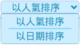

[English](./README.en.md) - [中文](./README.md)

## Introduction

A simple pixiv crawler. Naming is inspired from **Touhou Project**.

## Installation

1. First, install [Tampermonkey](https://chrome.google.com/webstore/detail/tampermonkey/dhdgffkkebhmkfjojejmpbldmpobfkfo) for Chrome or [Tampermonkey](https://addons.mozilla.org/zh-TW/firefox/addon/tampermonkey/) for Firefox or [other userscript managers](https://greasyfork.org/help/installing-user-scripts) you like.
2. Then, click [**`here`**](https://rawgit.com/FlandreDaisuki/Patchouli/master/dist/patchouli.user.js)

## Functions

- Find pictures automatically
- The UI with i18n (en, ja, zh, zh-tw)
- Filter by **bookmarks count** 
  
- Sort by **bookmarks count or upload time** 
  
- Use icon   to switch width
- Use icon  to indicate following illustrator
- Right click extension
  - Click on image
    - Like
    - Download original size image (only support single image)
    - Preview  original size images (not support ugoira)
    - Open add bookmark page (Just click  if you want to add bookmark without adding tags)
  - Click on illustrator name
    - Follow
    - Blacklist (fake mute)

## Usage

## Contribution

Questions or suggestions, post [issue](https://github.com/FlandreDaisuki/Patchouli/issues) :coffee:

## Lisence

The MIT License (MIT)

Copyright (c) 2016-2018 FlandreDaisuki

## Changelog

2018-06-03 v4.1.1

- Fix bookmark threshold decrease too fast to stuck UI. This fix will slow the crawler speed a little.

2018-06-01 v4.1.0

- Add right click extension
- Change icons

2018-05-17 v4.0.10

- Fix sorting by oldest wrong in search page (#17)

2018-05-12 v4.0.9

- Update theme color, style, animation
- Fix default bookmark count list can't disappear when click other place

2018-05-08 v4.0.8

- Fix pixiv trademark to "pixiv" (all lowercase)

2018-05-08 v4.0.7

- Add default bookmark count list for quick filtering (#16)

2018-04-25 v4.0.6

- Fix axios bug on Chrome (#15)

2018-03-17 v4.0.5

- Main button use mouseup event (Firefox sometimes can't work on click event)
- Add `en` name, description

2018-03-17 v4.0.4

- Fix duplicate illustId in v-for

2018-03-08 v4.0.3

- Enhence CSS style

2018-03-08 v4.0.2

- Fixed supported page type

2018-03-07 v4.0.1

- Fixed Korean i18n

2018-03-07 v4.0.0

- Use [Vuex](https://github.com/vuejs/vuex), [vue-i18n](https://github.com/kazupon/vue-i18n) plugins
- Follow the [Vue style guide](https://vuejs.org/v2/style-guide/)

2017-11-22 v3.0.4

(ignore before)
